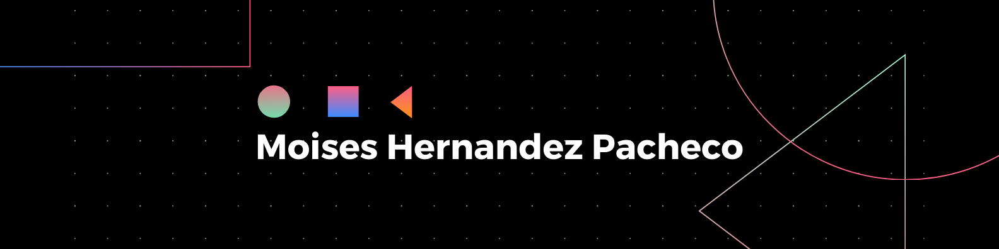

# 💫 About Me:
👋 **Hi everyone, I'm Moises Hernandez**  🌱 I’m currently learning **about algorithms, cryptography and computer science**  👨🏻‍💻 Fullstack developer located in Mexico City  🧠 **Applied Mathematics & CS student** at [UNAM](https://www.unam.mx/) in Mexico  🔎 I'm looking to collaborate in projects and technology communities in Mexico and the rest of the world 

## 🌐 Socials:
  

# 💻 Tech Stack:
                   
# 📊 GitHub Stats:
 
 

### ✍️ Random Dev Quote

---

<!-- Proudly created with GPRM ( https://gprm.itsvg.in ) -->
